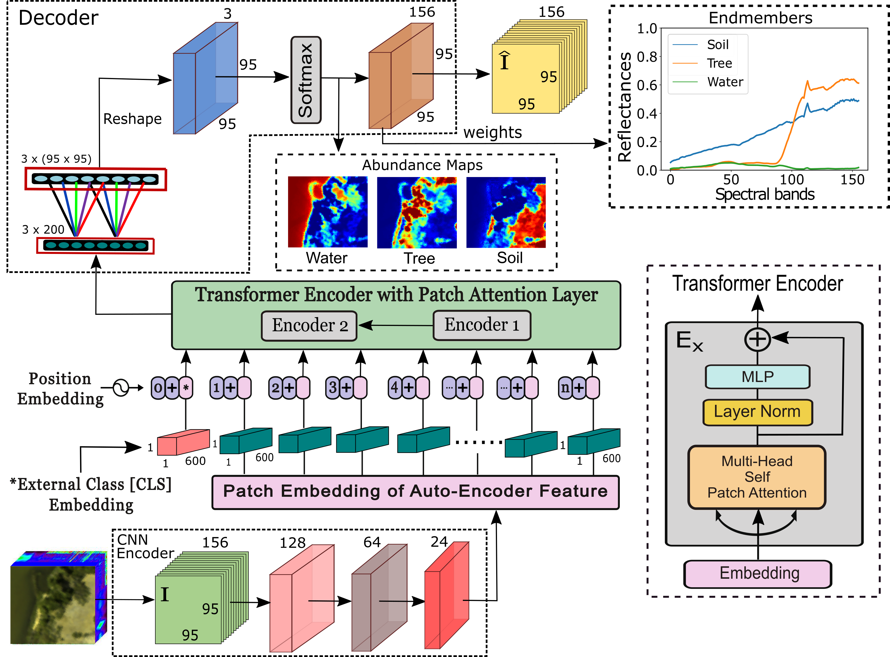

# Hyperspectral Unmixing using Transformer Network

[Preetam Ghosh](https://scholar.google.com/citations?user=2HrZI6sAAAAJ&hl=en), [Swalpa Kumar Roy](https://swalpa.github.io), [Bikram Koirala](https://visielab.uantwerpen.be/people/bikram-koirala), [Behnood Rasti](https://scholar.google.com/citations?user=hA_Xi6MAAAAJ&hl=en), and [Paul Scheunders](https://visielab.uantwerpen.be/people/paul-scheunders) 

The repository contains the PyTorch implementations for [Hyperspectral Unmixing using Transformer Network](https://ieeexplore.ieee.org/document/9848995).

<strong>:fire:New:bangbang:</strong> Code is now available here.
___________

---------------------
### Dataset

If you use the code in your research, we would appreciate a citation to the original paper:

	@article{ghosh2019hybridsn,
        	title={Hyperspectral Unmixing using Transformer Network},
		author={Ghosh, Preetam and Roy, Swalpa Kumar and Koirala, Bikram and Rasti, Behnood and Scheunders, Paul},
		journal={IEEE Transaction on Geoscience and Remote Sensing},
		volume={},
		no.={},
		pp.={01-17},
		year={2022}
		}
